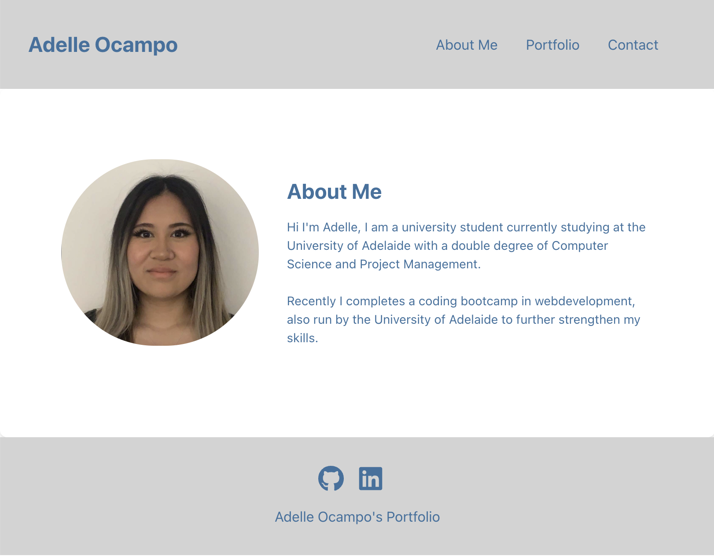
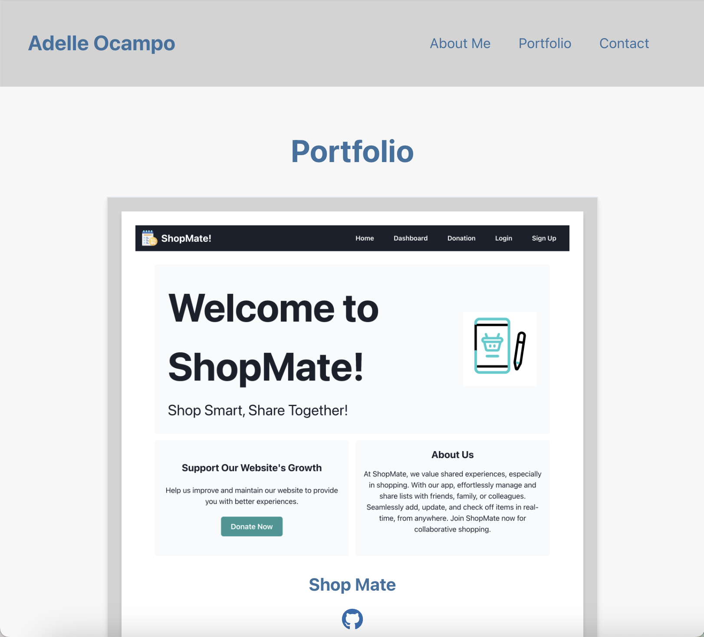
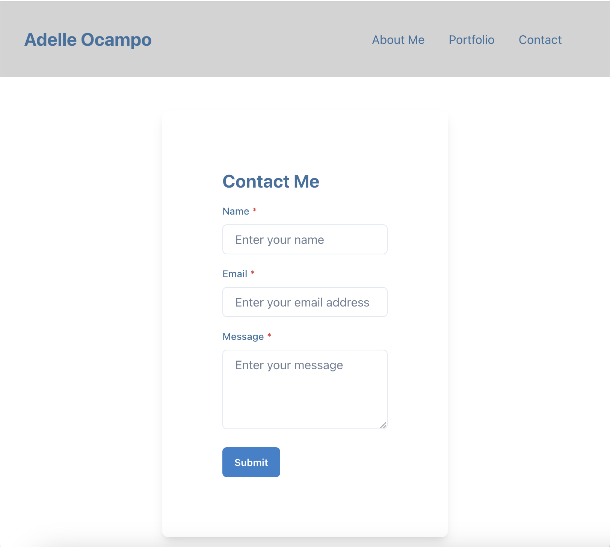

# React-Portfolio

## Description

This application was a project complete for the Adelaide University Coding Bootcamp. The application is a portfolio I created for myself with react and a react conponent libaray called chakra UI with was used for styling the react pages and conponents. Additionally this application was depolyed with Netify.

Live Link [here](https://adelleocamposportfolio.netlify.app)

## Usage

When clicking on the live link you are greeted with htis page: 

When using the navbar links, you can click on the portfolio page which leads you the a page with my perious projects:

When clicking on the contect me link you are lead to this page: 

